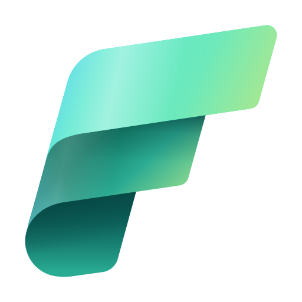

# Welcome to Fabric Essentials

We know how hard it is to identify GitHub repositories that you can use as part of your Microsoft Fabric solutions. Which is why carious members of the Microsoft Data Platform community have put together Fabric Essentials. So that you can quickly find the Microsoft Fabric related repository in GitHub that you need! 

By the Microsoft Data Platform community, for the Microsoft Data Platform Community.

Here you will find hand-picked GitHub repositories that we recommend to make the most out of Microsoft Fabric. We select these repositories based on various criteria, including their level of [GitHub hygiene](https://www.kevinrchant.com/2022/07/05/github-hygiene-for-microsoft-data-platform-repositories/).

Even though we recommend Git repositories created by various members of the community, we do highlight ones created by Microsoft that we think are essential as well. For example, the Fabric Toolbox.

You can see a list of all the recommended Microsoft Fabric related repositories created by members of the community [here](communityforks.md).

You can see a list of all the recommended Microsoft Fabric related repositories created by Microsoft [here](microsoftforks.md).

One thing we must stress is that if you find any of the repositories useful please give credit to the **original** source repository

    

<!-- counterAPI library -->

<!-- Add the counter instance-->

Count is provided by [CounterAPI](https://counterapi.com/)

